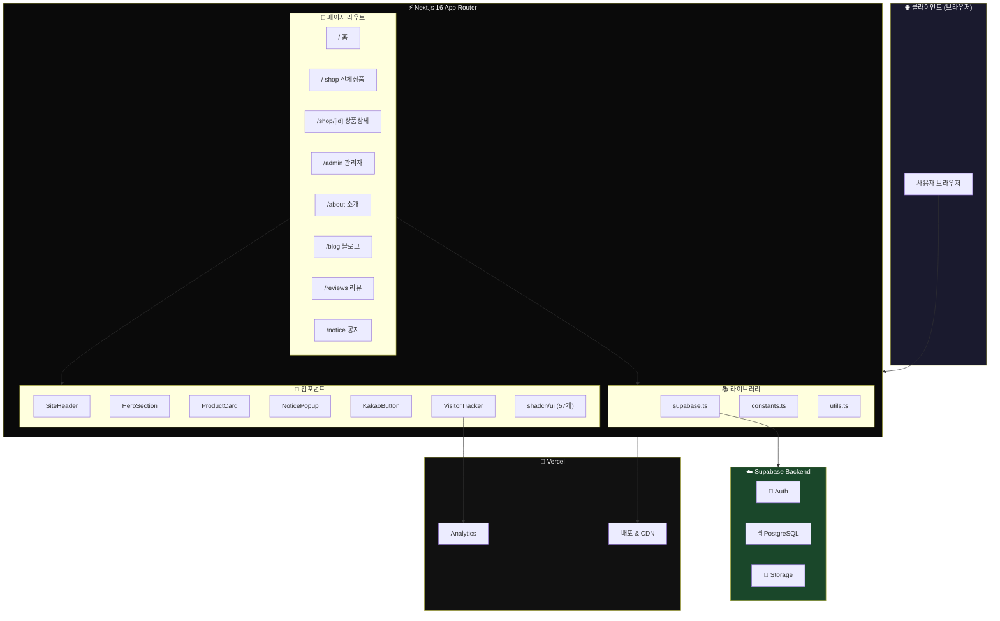
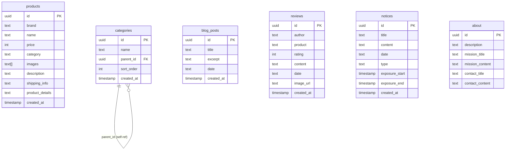
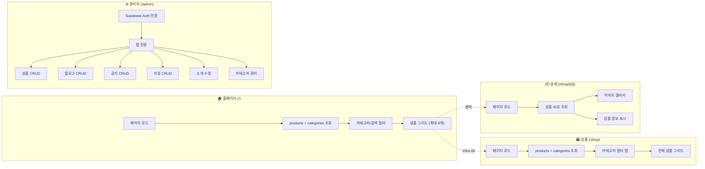
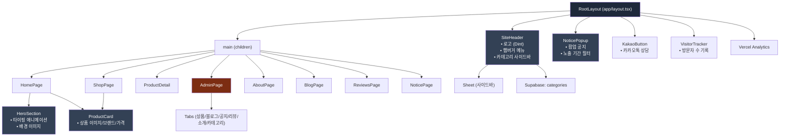
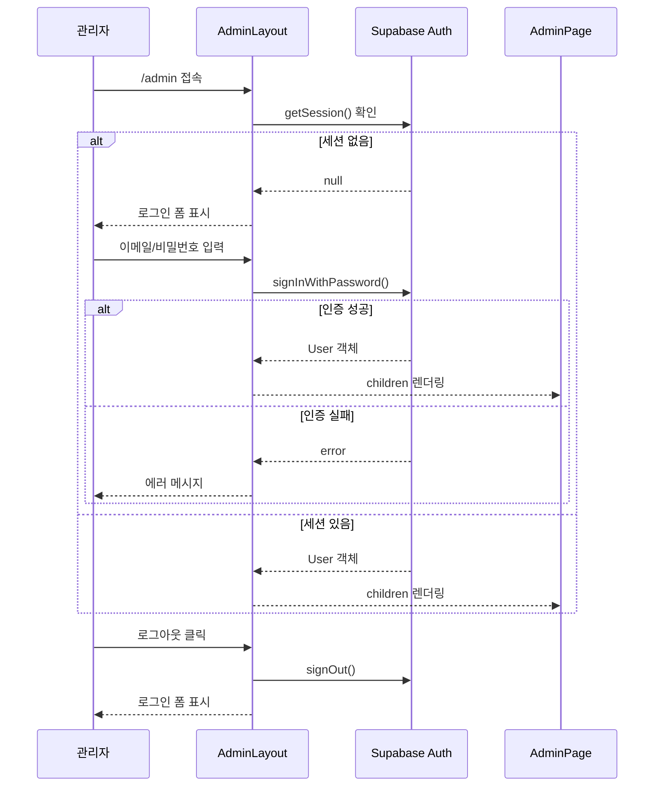
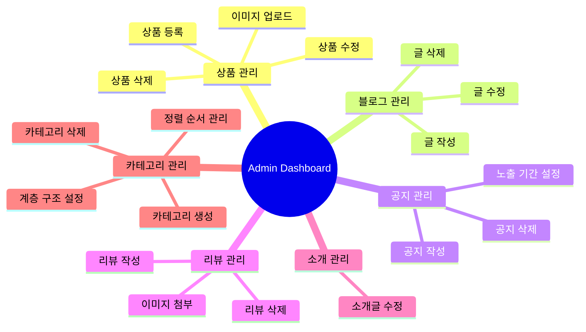
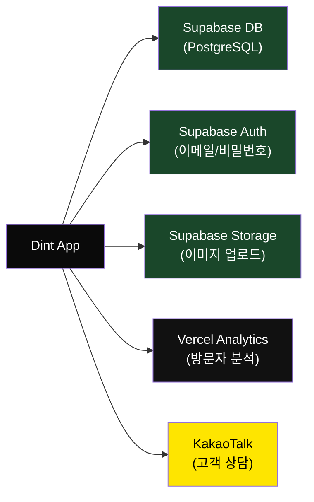

# 🏗️ Dint — 프로젝트 아키텍처 문서

> **Dint** | Premium Luxury E-Commerce App  
> Next.js 16 · React 19 · Supabase · TailwindCSS v4 · Radix UI

---

## 📌 기술 스택 요약

| 영역 | 기술 | 버전 |
|------|------|------|
| **프레임워크** | Next.js (App Router) | 16.1.6 |
| **UI 라이브러리** | React | 19.2.4 |
| **스타일링** | TailwindCSS | v4.2.0 |
| **UI 컴포넌트** | Radix UI (shadcn/ui) | 최신 |
| **백엔드/DB** | Supabase (PostgreSQL) | ^2.97.0 |
| **배포** | Vercel | - |
| **언어** | TypeScript | 5.7.3 |
| **폰트** | Inter (Google Fonts) | - |
| **아이콘** | Lucide React | ^0.564.0 |
| **차트** | Recharts | 2.15.0 |
| **폼** | React Hook Form + Zod | - |

---

## 🗂️ 디렉토리 구조

```
luxury-e-commerce-app/
├── app/                          # Next.js App Router (페이지)
│   ├── layout.tsx                # 루트 레이아웃 (Header, Footer, 전역 컴포넌트)
│   ├── page.tsx                  # 🏠 홈페이지 (Hero + 상품 그리드)
│   ├── globals.css               # 글로벌 스타일
│   ├── shop/
│   │   ├── page.tsx              # 🛍️ 전체 상품 목록 (카테고리 필터)
│   │   └── [id]/
│   │       └── page.tsx          # 📦 상품 상세 페이지 (동적 라우트)
│   ├── admin/
│   │   ├── layout.tsx            # 🔐 관리자 인증 레이아웃
│   │   └── page.tsx              # ⚙️ 관리자 대시보드 (CRUD)
│   ├── about/
│   │   └── page.tsx              # ℹ️ 소개 페이지
│   ├── blog/
│   │   └── page.tsx              # 📝 블로그 목록
│   ├── reviews/
│   │   └── page.tsx              # ⭐ 리뷰 목록
│   └── notice/
│       └── page.tsx              # 📢 공지사항 목록
│
├── components/                   # 재사용 컴포넌트
│   ├── hero-section.tsx          # 히어로 배너 (타이핑 애니메이션)
│   ├── product-card.tsx          # 상품 카드
│   ├── site-header.tsx           # 사이트 헤더 (네비게이션 + 카테고리 메뉴)
│   ├── notice-popup.tsx          # 공지 팝업
│   ├── kakao-button.tsx          # 카카오톡 상담 버튼
│   ├── visitor-tracker.tsx       # 방문자 추적
│   ├── theme-provider.tsx        # 테마 프로바이더
│   └── ui/                       # shadcn/ui 기반 UI 컴포넌트 (57개)
│       ├── button.tsx
│       ├── input.tsx
│       ├── dialog.tsx
│       ├── tabs.tsx
│       ├── carousel.tsx
│       ├── ... (50+ 컴포넌트)
│       └── toast.tsx
│
├── lib/                          # 유틸리티 & 설정
│   ├── supabase.ts               # Supabase 클라이언트 & DB 쿼리 함수
│   ├── constants.ts              # 타입 정의, 상수, 포맷 함수
│   └── utils.ts                  # cn() 유틸리티 (clsx + tailwind-merge)
│
├── hooks/                        # 커스텀 훅
│   ├── use-mobile.ts             # 모바일 감지 훅
│   └── use-toast.ts              # 토스트 알림 훅
│
├── styles/                       # 추가 스타일
├── public/                       # 정적 파일 (이미지, 파비콘)
├── next.config.mjs               # Next.js 설정
├── tsconfig.json                 # TypeScript 설정
└── package.json                  # 의존성 관리
```

---

## 🏛️ 전체 아키텍처 다이어그램



---

## 📊 데이터베이스 스키마 (Supabase)



---

## 🔄 페이지별 데이터 흐름



---

## 🧩 컴포넌트 관계도



---

## 🔐 인증 플로우 (Admin)



---

## 📱 라우팅 구조

| 경로 | 컴포넌트 | 설명 | 데이터 소스 |
|------|----------|------|-------------|
| `/` | `HomePage` | 히어로 + 상품 미리보기 (8개) | `products`, `categories` |
| `/shop` | `ShopPage` | 전체 상품 + 카테고리 필터 | `products`, `categories` |
| `/shop/[id]` | `ProductDetail` | 상품 상세 (이미지, 설명, 가격) | `products` (by ID) |
| `/admin` | `AdminPage` | 관리자 CRUD 대시보드 | 모든 테이블 |
| `/about` | `AboutPage` | 브랜드 소개 | `about` |
| `/blog` | `BlogPage` | 블로그 글 목록 | `blog_posts` |
| `/reviews` | `ReviewsPage` | 고객 리뷰 (별점 + 이미지) | `reviews` |
| `/notice` | `NoticePage` | 공지사항 목록 | `notices` |

---

## 🛠️ 관리자 대시보드 기능



---

## ⚙️ 핵심 함수 (lib/supabase.ts)

| 함수 | 테이블 | 설명 |
|------|--------|------|
| `getProducts()` | `products` | 전체 상품 조회 (최신순) |
| `getProductById(id)` | `products` | ID로 상품 1건 조회 |
| `getAbout()` | `about` | 소개 정보 조회 |
| `getBlogPosts()` | `blog_posts` | 블로그 글 목록 조회 |
| `getNotices()` | `notices` | 공지사항 목록 조회 |
| `getReviews()` | `reviews` | 리뷰 목록 조회 |
| `getCategories()` | `categories` | 카테고리 목록 조회 (정렬순) |

---

## 🎨 UI 컴포넌트 목록 (shadcn/ui)

총 **57개**의 UI 컴포넌트가 `components/ui/` 에 포함되어 있습니다:

| 카테고리 | 컴포넌트 |
|----------|----------|
| **입력** | Input, Textarea, Select, Checkbox, Radio Group, Switch, Slider, Calendar |
| **레이아웃** | Separator, Sidebar, Scroll Area, Accordion, Collapsible, Tabs |
| **피드백** | Toast, Alert, Spinner, Skeleton, Badge, Progress |
| **오버레이** | Dialog, Drawer, Sheet, Popover, Tooltip, Hover Card |
| **내비게이션** | Menubar, Command, Breadcrumb, Navigation Menu, Dropdown Menu |
| **데이터** | Table, Carousel, Avatar, Aspect Ratio |
| **기타** | Button, Toggle, Toggle Group, Form, Label, KBD |

---

## 📦 외부 서비스 연동



---

## 🔄 렌더링 전략

| 구분 | 방식 | 이유 |
|------|------|------|
| **모든 페이지** | `"use client"` (CSR) | Supabase 실시간 데이터 + 인터랙티브 UI |
| **데이터 페칭** | `useEffect` + `useState` | 클라이언트 사이드 데이터 로딩 |
| **이미지** | `next/image` | 자동 최적화 + lazy loading |
| **라우팅** | App Router (파일 기반) | Next.js 16 표준 |

---

> 📅 마지막 업데이트: 2026-02-21
