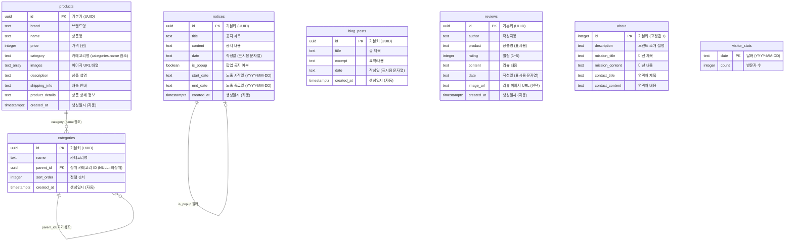
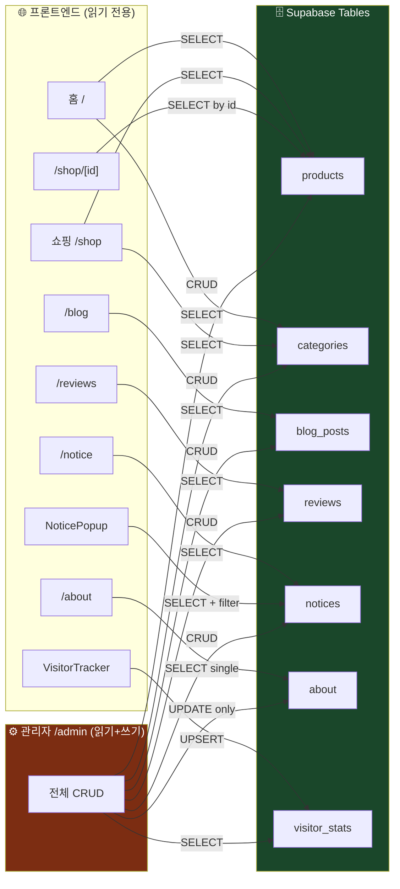

# 🗄️ Dint — 데이터베이스 구조 문서

> **Backend**: Supabase (PostgreSQL) + Supabase Storage  
> 총 **7개 테이블** + **1개 Storage 버킷**

---

## 📊 전체 DB 관계도 (ER Diagram)



---

## 📋 테이블별 상세 설명

### 1. `products` — 상품 테이블

> 쇼핑몰의 핵심 테이블. 모든 상품 정보를 저장합니다.

| 컬럼 | 타입 | 필수 | 설명 | 예시 |
|------|------|:----:|------|------|
| `id` | `uuid` | ✅ | 기본키 (자동 생성) | `a1b2c3d4-...` |
| `brand` | `text` | ✅ | 브랜드명 | `"MAISON DE LUXE"` |
| `name` | `text` | ✅ | 상품명 | `"클래식 레더 토트백"` |
| `price` | `integer` | ✅ | 가격 (원) | `320000` |
| `category` | `text` | ✅ | 카테고리명 (categories.name 연결) | `"가방"` |
| `images` | `text[]` | ✅ | 이미지 URL 배열 (Supabase Storage) | `["https://...png"]` |
| `description` | `text` | ✅ | 상품 설명 | `"최상급 이탈리아..."` |
| `shipping_info` | `text` | ❌ | 배송 안내 (기본값 제공) | `"모든 상품은..."` |
| `product_details` | `text` | ❌ | 상품 상세 정보 | `"정품 인증서..."` |
| `created_at` | `timestamptz` | ✅ | 생성일시 (기본값: now()) | `2026-02-20T...` |

**사용되는 곳:**
- 홈페이지 (`/`) — 최신 8개 상품 표시
- 쇼핑 페이지 (`/shop`) — 전체 상품 + 카테고리 필터
- 상세 페이지 (`/shop/[id]`) — 단일 상품 조회
- 관리자 (`/admin`) — CRUD

---

### 2. `categories` — 카테고리 테이블

> **자기 참조(Self-referencing)** 구조로 계층형 카테고리를 지원합니다.

| 컬럼 | 타입 | 필수 | 설명 | 예시 |
|------|------|:----:|------|------|
| `id` | `uuid` | ✅ | 기본키 (자동 생성) | `x1y2z3...` |
| `name` | `text` | ✅ | 카테고리명 | `"가방"` |
| `parent_id` | `uuid` | ❌ | 상위 카테고리 ID (NULL = 최상위) | `null` 또는 `"x1y2z3..."` |
| `sort_order` | `integer` | ✅ | 정렬 순서 | `1` |
| `created_at` | `timestamptz` | ✅ | 생성일시 | `2026-02-20T...` |

**사용되는 곳:**
- 헤더 사이드바 — 카테고리 네비게이션 (부모→자식 트리)
- 홈/쇼핑 — 카테고리 필터 탭
- 관리자 — 카테고리 트리 관리

**계층 구조 예시:**
```
가방 (parent_id: null, sort_order: 1)
  ├── 토트백 (parent_id: 가방.id, sort_order: 1)
  ├── 숄더백 (parent_id: 가방.id, sort_order: 2)
  └── 클러치 (parent_id: 가방.id, sort_order: 3)
신발 (parent_id: null, sort_order: 2)
  ├── 스니커즈 (parent_id: 신발.id, sort_order: 1)
  └── 옥스포드 (parent_id: 신발.id, sort_order: 2)
시계 (parent_id: null, sort_order: 3)
의류 (parent_id: null, sort_order: 4)
```

---

### 3. `blog_posts` — 블로그 글 테이블

| 컬럼 | 타입 | 필수 | 설명 | 예시 |
|------|------|:----:|------|------|
| `id` | `uuid` | ✅ | 기본키 | - |
| `title` | `text` | ✅ | 글 제목 | `"2026 S/S 트렌드"` |
| `excerpt` | `text` | ✅ | 요약/내용 | `"올 봄 주목해야 할..."` |
| `date` | `text` | ✅ | 표시용 날짜 문자열 | `"2026. 2. 21."` |
| `created_at` | `timestamptz` | ✅ | 생성일시 | - |

**사용되는 곳:** `/blog` 페이지, `/admin` CRUD

---

### 4. `reviews` — 리뷰 테이블

| 컬럼 | 타입 | 필수 | 설명 | 예시 |
|------|------|:----:|------|------|
| `id` | `uuid` | ✅ | 기본키 | - |
| `author` | `text` | ✅ | 작성자명 | `"김*수"` |
| `product` | `text` | ✅ | 상품명 (표시용 텍스트) | `"클래식 레더 토트백"` |
| `rating` | `integer` | ✅ | 별점 (1~5) | `5` |
| `content` | `text` | ✅ | 리뷰 내용 | `"퀄리티가 정말..."` |
| `date` | `text` | ✅ | 표시용 날짜 문자열 | `"2026. 2. 20."` |
| `image_url` | `text` | ❌ | 리뷰 이미지 URL | `"https://...png"` |
| `created_at` | `timestamptz` | ✅ | 생성일시 | - |

**사용되는 곳:** `/reviews` 페이지 (별점 + 이미지 표시), `/admin` CRUD

---

### 5. `notices` — 공지사항 테이블

> 일반 공지 + 팝업 공지 모두 관리. `is_popup`과 날짜 범위로 팝업 노출 제어.

| 컬럼 | 타입 | 필수 | 설명 | 예시 |
|------|------|:----:|------|------|
| `id` | `uuid` | ✅ | 기본키 | - |
| `title` | `text` | ✅ | 공지 제목 | `"설 연휴 배송 안내"` |
| `content` | `text` | ✅ | 공지 내용 | `"2/8~2/12 배송 휴무..."` |
| `date` | `text` | ✅ | 표시용 날짜 문자열 | `"2026. 2. 1."` |
| `is_popup` | `boolean` | ❌ | 팝업 공지 여부 | `true` |
| `start_date` | `text` | ❌ | 노출 시작일 (YYYY-MM-DD) | `"2026-02-01"` |
| `end_date` | `text` | ❌ | 노출 종료일 (YYYY-MM-DD) | `"2026-02-12"` |
| `created_at` | `timestamptz` | ✅ | 생성일시 | - |

**팝업 노출 로직:**
```
is_popup === true
AND (start_date 없음 OR start_date <= 오늘)
AND (end_date 없음 OR end_date >= 오늘)
→ 팝업으로 노출
```

**사용되는 곳:**
- `/notice` 페이지 — 전체 공지 목록
- `NoticePopup` 컴포넌트 — 메인 진입 시 팝업
- `/admin` — 팝업 공지 CRUD + 노출 기간 설정

---

### 6. `about` — 소개 페이지 테이블

> **단일 레코드** (id = 1). 브랜드 소개 정보를 저장합니다.

| 컬럼 | 타입 | 필수 | 설명 | 예시 |
|------|------|:----:|------|------|
| `id` | `integer` | ✅ | 기본키 (고정값: 1) | `1` |
| `description` | `text` | ✅ | 브랜드 설명 | `"Dint는 프리미엄..."` |
| `mission_title` | `text` | ✅ | 미션 섹션 제목 | `"OUR MISSION"` |
| `mission_content` | `text` | ✅ | 미션 섹션 내용 | `"최고의 퀄리티..."` |
| `contact_title` | `text` | ✅ | 연락처 섹션 제목 | `"CONTACT"` |
| `contact_content` | `text` | ✅ | 연락처 내용 | `"카카오톡: ..."` |

**사용되는 곳:** `/about` 페이지, `/admin` 수정 (항상 UPDATE, INSERT 없음)

---

### 7. `visitor_stats` — 방문자 통계 테이블

> 일별 방문자 수를 기록. 세션당 1회만 카운트 (`sessionStorage` 사용).

| 컬럼 | 타입 | 필수 | 설명 | 예시 |
|------|------|:----:|------|------|
| `date` | `text` | ✅ | 날짜 (YYYY-MM-DD) = PK 역할 | `"2026-02-21"` |
| `count` | `integer` | ✅ | 해당일 방문자 수 | `142` |

**동작 방식:**
```
1. 페이지 로드 시 sessionStorage 확인 → 이미 추적됐으면 스킵
2. 오늘 날짜 레코드 존재? → UPDATE count + 1
3. 없으면? → INSERT { date: today, count: 1 }
4. sessionStorage에 "visitor_tracked" 저장
```

**사용되는 곳:**
- `VisitorTracker` 컴포넌트 (RootLayout) — 자동 기록
- `/admin` — 오늘/총 방문자 수 대시보드 표시

---

## 📁 Storage 버킷

### `product-images` 버킷

> 상품 및 리뷰 이미지 업로드용 Supabase Storage 버킷

| 항목 | 설명 |
|------|------|
| **버킷 이름** | `product-images` |
| **경로 구조** | `products/{random_filename}.{ext}` |
| **업로드 방식** | `supabase.storage.from("product-images").upload(...)` |
| **URL 생성** | `supabase.storage.from("product-images").getPublicUrl(...)` |
| **사용 대상** | 상품 이미지 (`products.images[]`), 리뷰 이미지 (`reviews.image_url`) |

---

## 🔄 테이블별 CRUD 매핑



---

## 📊 각 테이블 쿼리 패턴

| 테이블 | 정렬 기준 | 쿼리 패턴 |
|--------|-----------|-----------|
| `products` | `created_at DESC` | 전체 조회 / ID 단건 조회 |
| `categories` | `sort_order ASC` | 전체 조회 → 프론트에서 parent/child 트리 구성 |
| `blog_posts` | `created_at DESC` | 전체 조회 |
| `reviews` | `created_at DESC` | 전체 조회 |
| `notices` | `created_at DESC` | 전체 조회 → 프론트에서 is_popup + 날짜 필터 |
| `about` | 없음 (단일) | `.single()` 조회 |
| `visitor_stats` | 없음 | 오늘 날짜로 조회 / 전체 합산 |

---

## 🔐 Supabase Auth

| 항목 | 설명 |
|------|------|
| **인증 방식** | 이메일 + 비밀번호 (`signInWithPassword`) |
| **사용 범위** | `/admin` 경로에서만 사용 |
| **세션 관리** | `supabase.auth.getSession()` + `onAuthStateChange` |
| **보호 대상** | Admin 대시보드 전체 (레이아웃 수준 보호) |

---

## ⚠️ 주의할 점

> [!NOTE]
> `products.category`는 `categories.name`을 텍스트로 저장합니다.  
> 외래키(FK)가 아닌 **문자열 매칭**이므로 카테고리 이름 변경 시 기존 상품의 category 값도 수동 업데이트가 필요합니다.

> [!NOTE]
> `notices.start_date`, `notices.end_date`는 `text` 타입 (`"YYYY-MM-DD"` 형식)입니다.  
> 문자열 비교(`<=`, `>=`)로 날짜 범위 필터링을 수행합니다.

> [!NOTE]
> `about` 테이블은 항상 **id = 1** 인 단일 레코드만 존재합니다.  
> INSERT는 사용되지 않고 UPDATE만 수행됩니다.

> [!NOTE]
> `visitor_stats`에는 RLS(Row Level Security) 정책이 필요할 수 있습니다.  
> 현재 클라이언트에서 직접 INSERT/UPDATE하므로 적절한 정책 설정이 필요합니다.

---

> 📅 마지막 업데이트: 2026-02-21
